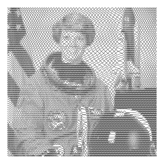
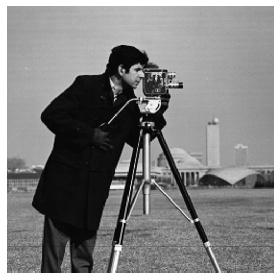
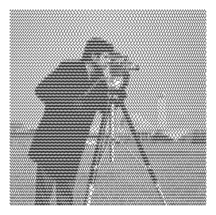
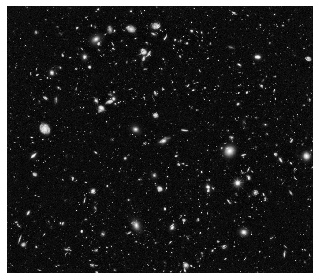
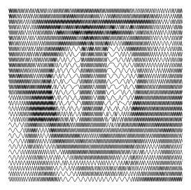

# Laser tools
A collection of software tools for my laser cutter/engraver.

## line_shading.ipynb
Turn an image into a sine wave line shaded image, where the frequency of the sine wave is proportional to the intensity of the image. 
Try running the code yourself using Binder: [https://mybinder.org/v2/gh/0not/laser_tools/HEAD?filepath=line_shading.ipynb](https://mybinder.org/v2/gh/0not/laser_tools/HEAD?filepath=line_shading.ipynb).

### Examples
Input image                | Output image  
:-------------------------:|:-------------------------:
      |  
      |  
      |  
      |  

## calibration.ipynb
Generate a grid of calibration squares, where each square is a different combination of speed and laser power.
Try running the code yourself using Binder: [https://mybinder.org/v2/gh/0not/laser_tools/HEAD?filepath=calibration.ipynb](https://mybinder.org/v2/gh/0not/laser_tools/HEAD?filepath=calibration.ipynb).
